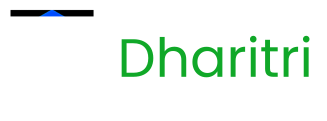

# 

A sovereign regenerative Layer-1 blockchain.

Dharitri builds:
• 0% interest farmer financing
• Carbon credit certification (MRV)
• Real-world asset tokenization
• Stable-value asset (COME)
• Climate-positive infrastructure

---

## 🌍 Ecosystem Overview

---

## 🧱 Architecture Layers

### Core Layer
- dharitri-core
- dharitri-vm
- dharitri-consensus

### Smart Contract Layer
- dharitri-rwa
- dharitri-mrv
- dharitri-come

### Infrastructure
- dharitri-indexer
- dharitri-proxy
- dharitri-devnet-config

### Applications
- farmer-app
- prewa-dapp

---

## 🚀 Roadmap 2026

Q1 – Devnet stabilization  
Q2 – RWA v1 contracts  
Q3 – Carbon MRV integration  
Q4 – Public testnet  

---

## 🤝 Contribute

1. Read Architecture docs  
2. Setup local devnet  
3. Pick “good first issue”  
4. Submit PR  

---

## 🌍 Real-World Impact

• 20 farmers in Kenya pilot  
• Soil & water infrastructure deployed  
• Carbon monitoring integration in progress  

---

## 📜 Governance

Dharitri Foundation – Non-profit mission governance  
Dugong Global Services – Technical development arm  

-------------------------------------------------
|                                               | 
|        https://giveth.io/project/dharitri     | 
|                                               |
|-----------------------------------------------