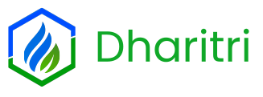
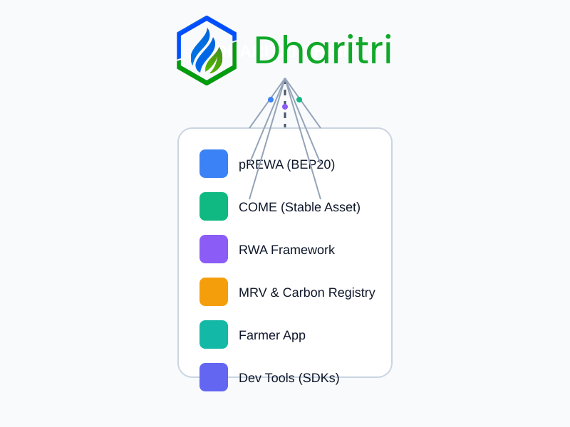

# 

A sovereign regenerative Layer-1 blockchain.

Dharitri builds:
• low interest farmer financing

• Carbon credit certification (MRV)

• Real-world asset tokenization

• Stable-value asset (COME)

• Climate-positive infrastructure

---

## Ecosystem Overview

---

## 🚀 Roadmap 2026

Q1 - Devnet stabilization  
Q2 - Public testnet  
Q2 - RWA v1 contracts  
Q3 - Carbon MRV integration
Q4 - Dharitri Mainnet

 

---

## Contribute

1. Read Architecture docs  
2. Setup local devnet  
3. Pick (good first issue)
4. Submit PR  

---

## Real-World Impact

• 20 farmers in Kenya pilot  
• Soil & water infrastructure deployed  
• Carbon monitoring integration in progress  

---

##  Governance

Dharitri Foundation – Non-profit mission governance  

https://giveth.io/project/dharitri